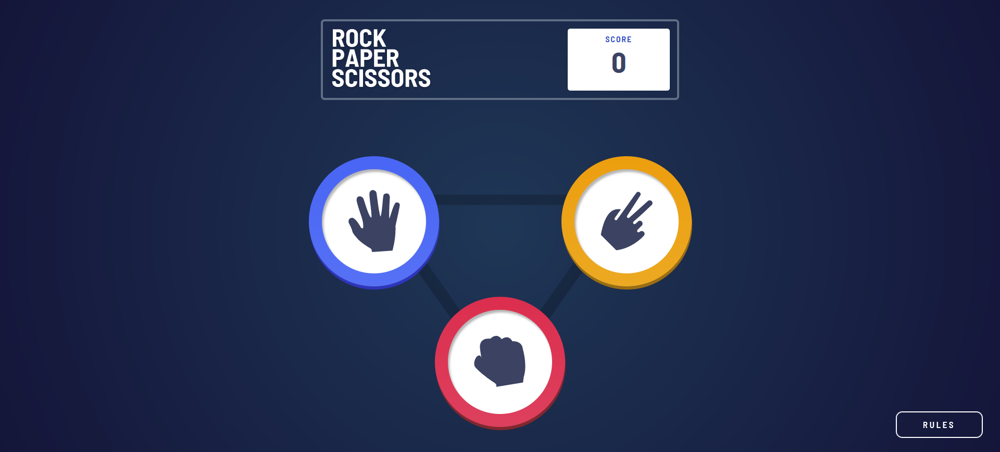

# Frontend Mentor - Rock, Paper, Scissors solution

This is a solution to the [Rock, Paper, Scissors challenge on Frontend Mentor](https://www.frontendmentor.io/challenges/rock-paper-scissors-game-pTgwgvgH). Frontend Mentor challenges help you improve your coding skills by building realistic projects. 

## Table of contents

- [Overview](#overview)
  - [The challenge](#the-challenge)
  - [Screenshot](#screenshot)
  - [Links](#links)
- [My process](#my-process)
  - [Built with](#built-with)
  - [What I learned](#what-i-learned)
  - [Continued development](#continued-development)

- [Author](#author)


## Overview

### The challenge

Users should be able to:

- View the optimal layout for the game depending on their device's screen size
- Play Rock, Paper, Scissors against the computer


### Screenshot




### Links

- Solution URL: [Git repo link](https://github.com/Gloryjaw/Rock_paper_scissors_web_app)
- Live Site URL: [Live site url](https://657fe8a0201fdd7f2b6818b6--voluble-centaur-7fbce8.netlify.app)

## My process

### Built with

- Semantic HTML5 markup
- CSS custom properties
- Flexbox
- Mobile-first workflow
- [Svelte](https://svelte.dev/) - JS Framework


### What I learned
Since this is my first project on svelte, It increased my grasp on the basic concept of svelte like dividing a site into various components, communication between parent and child components using props and custom event dispatching. Also, I have learned how to create perfect circles with css only: 


```css
    .outer_button{
        border: none;
        border-radius: 100%;
        width: 100%;
        height: 0;
        padding-bottom: min(100%, 200px);
        position: relative;
        display: block;
        max-width: 200px;
    }
```

I didn't know that giving padding in percentage unit will be relative of the width of that element, giving it 100% padding bottom and 100% width with border radious 100% will make a perfect circle, I have also limited the width of that circle with giving max width and limiting it's height with min function.

### Continued development

I will continue learning about animations and transitions in svelte. Also, I will now start learning svelte kit.


## Author


- Frontend Mentor - [@Gloryjaw](https://www.frontendmentor.io/profile/Gloryjaw)


